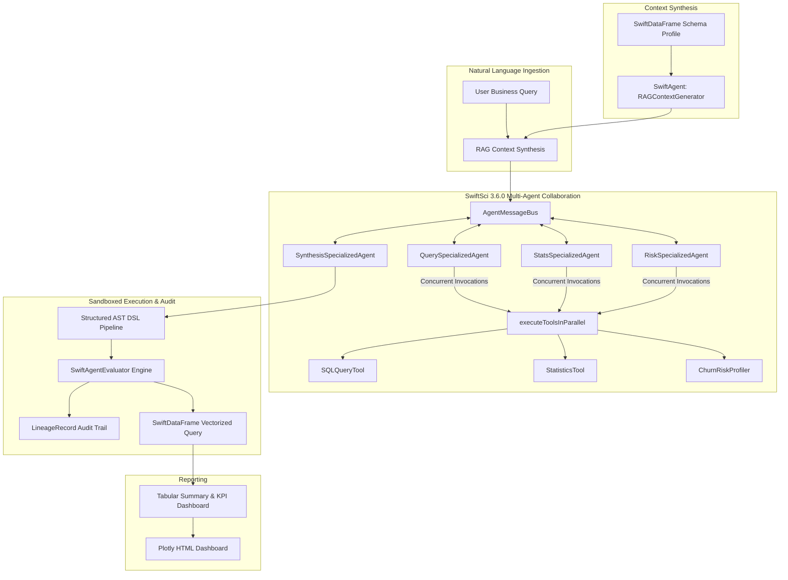

# 🤖 SwiftDataAnalyst-Agent — Technical Architecture & Agent DSL Guide

This guide details the Sandboxed AST Domain-Specific Language (DSL), RAG context synthesis, Multi-Agent collaborative loops, and pipeline lineage auditing in **SwiftDataAnalyst-Agent** powered by **SwiftSci 3.6.0**.

---

## 1. System Pipeline & Orchestration Architecture



---

## 2. Sandboxed DSL Grammar Specification

To prevent code injection vulnerabilities and prompt-leakage risks, the agent uses an Abstract Syntax Tree (AST) grammar evaluator without relying on dynamic runtime code evaluation:

```ebnf
<Command>     ::= "filter" <Condition>
                | "select" <IdentifierList>
                | "head" <Integer>
                | "tail" <Integer>
                | "sample" <Integer>
                | "groupby" <Identifier>
                | "rename" <Identifier> "to" <Identifier>
                | "dropnulls"
                | "fillnulls" <Literal>

<Condition>   ::= <Identifier> <Operator> <Literal>
<Operator>    ::= "==" | "!=" | ">" | "<" | ">=" | "<="
<Literal>     ::= <StringLiteral> | <NumberLiteral>
```

---

## 3. Token-Efficient RAG Schema Extraction

`RAGContextGenerator` analyzes tabular data buffers in memory to generate compact markdown descriptors for Large Language Model (LLM) prompts:

```markdown
## Dataset Profile
- Rows: 500, Columns: 6
- Schema: customer_id (Int64), age (Double), country (String), category (String), order_value (Double), churn_risk (Double)
- Numeric Distribution:
  - order_value: [min: 12.5, mean: 556.0, max: 998.4]
  - churn_risk:  [min: 0.05, mean: 0.48, max: 0.95]
```

---

## 4. Multi-Agent Collaboration & Parallel Tool Dispatch

In **SwiftSci 3.6.0**, the agent leverages `MultiAgentOrchestrator` and `AgentMessageBus` to coordinate specialized roles:

1. **`QuerySpecializedAgent` (`DatabaseAnalyst`):** Decomposes the business query into safe AST filtering expressions.
2. **`StatsSpecializedAgent` (`Statistician`):** Evaluates central tendency, dispersion, and quartiles on primary metric columns.
3. **`RiskSpecializedAgent` (`RiskAnalyst`):** Analyzes retention risk brackets and customer lifetime values.
4. **`SynthesisSpecializedAgent` (`SynthesisLead`):** Collects tool results from prior dialogue turns and emits the final consensus answer (`FINAL ANSWER:`).

Tool executions requested by agents are executed concurrently across CPU threads using structured Swift Concurrency `withTaskGroup` via `executeToolsInParallel`:

$$	ext{Latency} = \mathcal{O}(\max_{i} T_i) \quad 	ext{vs.} \quad \mathcal{O}\left(\sum_{i} T_i
ight)$$

---

## 5. Pipeline Data Lineage Auditing

Every transformation applied to the dataset is captured in a cryptographically verifiable, reproducible audit log via `LineageRecord`:

```swift
public struct LineageRecord: Sendable, Codable, Equatable {
    public let stepIndex: Int
    public let operation: String
    public let inputRows: Int
    public let outputRows: Int
    public let timestamp: Date
}
```

Audit entries record row cardinality transitions across every step, ensuring enterprise compliance and analytical reproducibility.
