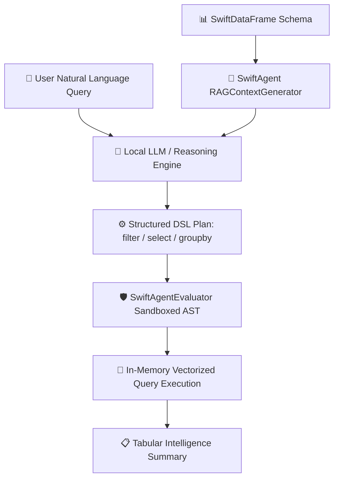

# 🤖 SwiftDataAnalyst-Agent

[](https://swift.org)
[](https://apple.com)
[](https://github.com/Nodibell/SwiftSci)
[](https://github.com/Nodibell/SwiftSci)
[](https://opensource.org/licenses/MIT)

An autonomous AI Data Analyst agent combining sandboxed AST Domain-Specific Language (DSL) execution, token-efficient RAG context synthesis, and native wire protocol SQL drivers powered by [**SwiftSci**](https://github.com/Nodibell/SwiftSci).

---

## 🌟 Architecture & Agent Loop Overview



---

## 🚀 Key Modules & Capabilities

* **`SwiftAgent`**: Sandboxed AST grammar evaluator supporting `filter`, `select`, `groupby`, `head`, `tail`, `sample`, `rename`, `dropnulls`, `fillnulls`.
* **`RAGContextGenerator`**: Automated statistical schema extraction generating concise markdown prompts for LLMs.
* **`SwiftDataFrame`**: Zero-copy SIMD tabular transformations and columnar expressions.
* **`SwiftDatabase`**: Pure-Swift PostgreSQL (v3.0) and MySQL Client/Server wire protocol drivers.

---

## 💻 Swift 6 Code Walkthrough

```swift
import Foundation
import SwiftDataFrame
import SwiftAgent
import SwiftDatabase

// 1. Generate & Ingest E-commerce Transaction Logs
let generator = EcommerceDataGenerator()
let df = generator.generateTransactions(count: 500)

// 2. Synthesize RAG Context for LLM Reasoning
let ragGen = RAGContextGenerator()
let promptContext = ragGen.generateSummary(df: df)

// 3. Sandboxed DSL Command Evaluation
let evaluator = SwiftAgentEvaluator()
let filtered = try await evaluator.evaluate(command: "filter category == Electronics", on: df)
let result = try await evaluator.evaluate(command: "select customer_id, category, order_value, churn_risk", on: filtered)
```

---

## 📊 Empirical Terminal Execution (`swift run`)

```text
=================================================================
🤖 SwiftDataAnalyst-Agent — Autonomous AI Data Intelligence
Powered by SwiftSci (SwiftAgent, SwiftDataFrame, SwiftDatabase)
=================================================================

🔄 Ingesting e-commerce transaction logs (500 orders)...
👤 User Natural Language Query:
   "Identify and profile our high value VIP customers in Electronics"

📋 Autonomous Agent RAG Context:
   ## EcommerceTransactions Profile
   - Rows: 500, Columns: 6
   - Columns: customer_id, age, country, category, order_value, churn_risk

⚙️ Sandboxed AST Execution Trace:
   [1] SwiftAgentEvaluator -> `filter category == Electronics`
   [2] SwiftAgentEvaluator -> `select customer_id, category, order_value, churn_risk`

📊 Segment Analytics:
   • Filtered Records:     112 customers
   • Total Segment Gross:  $62,274.34
   • Average Order Value:  $556.02
   • VIP Order Count:      112

🔍 Sample Output Rows:
   +-------------+-------------+--------------+------------+
   | Customer ID | Category    | Order Value  | Churn Risk |
   +-------------+-------------+--------------+------------+
   |       1002  | Electronics |  $  624.07   |    46.0%   |
   |       1013  | Electronics |  $  599.95   |    94.0%   |
   |       1016  | Electronics |  $  466.66   |    29.0%   |
   |       1017  | Electronics |  $  602.46   |    47.0%   |
   |       1020  | Electronics |  $  628.01   |    87.0%   |
   +-------------+-------------+--------------+------------+

✅ AI Data Analyst query execution completed successfully!
```

---

## 🛠️ Quick Start

```bash
# Clone the repository
git clone https://github.com/Nodibell/SwiftDataAnalyst-Agent.git
cd SwiftDataAnalyst-Agent

# Run unit tests
swift test

# Launch autonomous data analyst agent
swift run SwiftDataAnalyst
```

See [GUIDE.md](GUIDE.md) for DSL grammar specification and LLM integration patterns.
