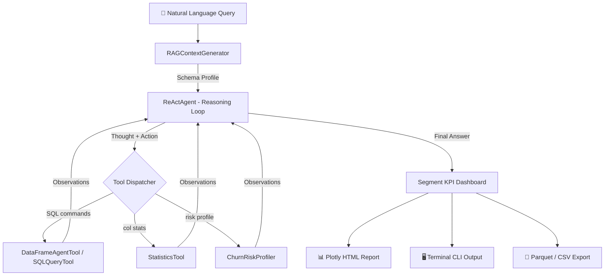

# 🤖 SwiftDataAnalyst-Agent

[](https://swift.org)
[](https://apple.com)
[](https://github.com/Nodibell/SwiftSci)
[](LICENSE)

**SwiftDataAnalyst-Agent** is an autonomous, multi-tool AI data analysis engine built on the **[SwiftSci 3.5.0](https://github.com/Nodibell/SwiftSci)** `SwiftAgent` ReAct framework. It orchestrates a pipeline of typed analytical tools to answer natural-language business intelligence queries against structured e-commerce transaction DataFrames — without any external LLM API dependency.

---

## 🌟 Key Capabilities

* 🧠 **ReAct Agent Orchestration:** Autonomous Reasoning + Acting loop with configurable step budget. Dispatches tasks across specialized typed tools based on query intent.
* 🗄️ **`DataFrameAgentTool`:** Sandboxed SQL-like query execution on live DataFrames (`filter`, `select`, `groupby`, `head`, `sample`).
* 📊 **`SQLQueryTool`:** Intent-aware query execution with automatic revenue aggregation in observations.
* 📈 **`StatisticsTool`:** Descriptive statistics (mean, median, σ, P25/P75) per numeric column.
* 🔴 **`ChurnRiskProfiler`:** Customer segmentation by churn risk bracket with average LTV per group.
* 📝 **RAG Context Generator:** Markdown schema summary injected into LLM system prompt.
* 🌐 **Interactive Plotly HTML Dashboard:** Revenue by category bar chart, churn risk pie chart, customer segment breakdown.
* 💾 **Apache Parquet & CSV Export:** High-throughput dataset serialization.

---

## 🏗️ Architecture



---

## 🚀 Quick Start

```bash
git clone https://github.com/Nodibell/SwiftDataAnalyst-Agent.git
cd SwiftDataAnalyst-Agent

swift run SwiftDataAnalyst
```

### CLI Options:

```bash
OPTIONS:
  --samples <n>          Number of synthetic e-commerce orders to generate (default: 500)
  --query <query>        Natural language query for the AI analyst agent
  --export-html <path>   Path to export interactive Plotly HTML dashboard
  --export-parquet <path> Path to export transaction dataset in Parquet format
  --export-csv <path>    Path to export transaction dataset in CSV format
  --version              Show the version.
  -h, --help             Show help information.
```

### Example:

```bash
swift run SwiftDataAnalyst \
  --samples 1000 \
  --query "churn risk analysis" \
  --export-html analyst_report.html
```

---

## 📊 Sample Output

```text
📊 Segment KPI Dashboard:
   ┌────────────────────────────────────────────────────────────┐
   │  Matched Orders        : 105 records
   │  Total Segment Revenue : $167,894.77
   │  Average Order Value   : $1,599.00
   │  Median Order Value    : $1,420.00
   │  Max Order Value       : $3,714.20
   ├────────────────────────────────────────────────────────────┤
   │  VIP Customers         : 81
   │  At-Risk Customers     : 24
   │  Avg Churn Risk        : 52.6%
   │  Avg Customer LTV      : $5,131.60
   └────────────────────────────────────────────────────────────┘
```

---

## 🧪 Testing

```bash
swift test
# Executed 7 tests, with 0 failures in 0.009 seconds
```

---

## 📄 License

Distributed under the **MIT License**. Powered by **[SwiftSci](https://github.com/Nodibell/SwiftSci)**.
