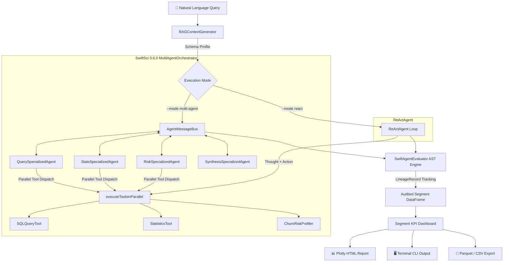

# 🤖 SwiftDataAnalyst-Agent

[](https://swift.org)
[](https://apple.com)
[](https://github.com/Nodibell/SwiftSci)
[](LICENSE)

**SwiftDataAnalyst-Agent** is an autonomous, multi-tool AI data analysis engine built on **[SwiftSci 3.6.0](https://github.com/Nodibell/SwiftSci)** (`SwiftAgent` MultiAgent & ReAct frameworks). It orchestrates a collaborative team of specialized analytical agents over an asynchronous message bus, performing parallel tool execution and answering natural-language business intelligence queries against structured e-commerce transaction DataFrames — without external LLM API dependencies.

---

## 🌟 Key Capabilities

* 👥 **Multi-Agent Orchestration (`MultiAgentOrchestrator`):** SwiftSci 3.6.0 asynchronous event bus (`AgentMessageBus`) coordinating specialized collaborating agents (`QuerySpecializedAgent`, `StatsSpecializedAgent`, `RiskSpecializedAgent`, `SynthesisSpecializedAgent`) with structured parallel tool dispatch.
* 🧠 **Autonomous ReAct Agent:** Single-agent Reasoning + Acting loop with step budget control, `EarlyStopping` safeguards, and per-tool timeout enforcement (`toolTimeoutSeconds: 15.0`).
* 📜 **Pipeline Data Lineage Tracking:** Auditable lineage trail recording step indices, AST operations, and input/output row count transitions via `LineageRecord`.
* 🗄️ **`DataFrameAgentTool` & `SQLQueryTool`:** Sandboxed AST query execution on live DataFrames (`filter`, `select`, `groupby`, `head`, `sample`).
* 📈 **`StatisticsTool`:** Descriptive statistics (mean, median, σ, P25/P75) per numeric column.
* 🔴 **`ChurnRiskProfiler`:** Customer segmentation across churn risk brackets with group average LTV.
* 📝 **RAG Context Generator:** Markdown schema profile dynamically synthesized for LLM system prompts.
* 🌐 **Interactive Plotly HTML Dashboard:** Revenue by category bar chart, churn risk pie chart, customer segment breakdown.
* 💾 **Apache Parquet & CSV Export:** High-throughput dataset serialization.

---

## 🏗️ Architecture



---

## 🚀 Quick Start

```bash
git clone https://github.com/Nodibell/SwiftDataAnalyst-Agent.git
cd SwiftDataAnalyst-Agent

swift run SwiftDataAnalyst
```

### CLI Options:

```bash
OPTIONS:
  --samples <n>          Number of synthetic e-commerce orders to generate (default: 500)
  --query <query>        Natural language query for the AI analyst agent
  --mode <mode>          Execution mode: 'multi-agent' (collaborative team) or 'react' (single agent). Default: multi-agent
  --export-html <path>   Path to export interactive Plotly HTML dashboard (default: analyst_dashboard.html)
  --export-parquet <path> Path to export transaction dataset in Parquet format
  --export-csv <path>    Path to export transaction dataset in CSV format
  --version              Show the version (3.6.0).
  -h, --help             Show help information.
```

### Example (Multi-Agent Team):

```bash
swift run SwiftDataAnalyst \
  --samples 1000 \
  --query "Identify and profile our high value VIP customers in Electronics" \
  --mode multi-agent \
  --export-html analyst_report.html
```

---

## 📊 Sample Multi-Agent Output

```text
╔══════════════════════════════════════════════════════════════════════╗
║  🤖 SwiftDataAnalyst-Agent — Autonomous AI E-Commerce Intelligence   ║
║  Powered by SwiftSci 3.6.0 · MultiAgentOrchestrator & ReAct          ║
╚══════════════════════════════════════════════════════════════════════╝

💬 User Query: "Identify VIP customers in Electronics"
🚀 Execution Mode: MULTI-AGENT
👥 Assembling MultiAgentOrchestrator collaborative team:
   • QuerySpecializedAgent  [DatabaseAnalyst]
   • StatsSpecializedAgent  [Statistician]
   • RiskSpecializedAgent   [RiskAnalyst]
   • SynthesisSpecializedAgent [SynthesisLead]

📡 AgentMessageBus Inter-Agent Dialogue:
   🗣️ [QuerySpecializedAgent] (DatabaseAnalyst): Applied dataset query strategy.
       🛠️ [SQLQuery] ✅ Output: 📋 Query result: 26 rows
   🗣️ [StatsSpecializedAgent] (Statistician): Computed distribution statistics.
       🛠️ [Statistics] ✅ Output: 📊 Statistics for 'order_value': Mean: 667.42, Median: 358.77
   🗣️ [RiskSpecializedAgent] (RiskAnalyst): Segmented customer cohorts.
       🛠️ [ChurnRiskProfiler] ✅ Output: 🔴 Churn Risk Segmentation: Low (24), Med (41), High (35)
   🗣️ [SynthesisSpecializedAgent] (SynthesisLead):
       FINAL ANSWER: AI Multi-Agent Consensus Analysis Completed.

📜 Pipeline Data Lineage Audit Trail (2 steps):
   [1] filter(order_value) -> input: 100 rows, output: 26 rows
   [2] select(...) -> input: 26 rows, output: 26 rows

📊 Segment KPI Dashboard:
   ┌────────────────────────────────────────────────────────────┐
   │  Matched Orders        : 26 records
   │  Total Segment Revenue : $46,295.21
   │  Average Order Value   : $1,780.59
   │  Median Order Value    : $1,614.75
   │  Max Order Value       : $3,714.20
   ├────────────────────────────────────────────────────────────┤
   │  VIP Customers         : 19
   │  At-Risk Customers     : 7
   │  Avg Churn Risk        : 55.7%
   │  Avg Customer LTV      : $6,032.29
   ├────────────────────────────────────────────────────────────┤
   │  Top Category          : Electronics
   │  Top Country           : JP
   │  Top Sales Channel     : Mobile App
   └────────────────────────────────────────────────────────────┘
```

---

## 🧪 Testing

```bash
swift test
# Executed 10 tests, with 0 failures in 0.013 seconds
```

---

## 📄 License

Distributed under the **MIT License**. Powered by **[SwiftSci](https://github.com/Nodibell/SwiftSci)**.
